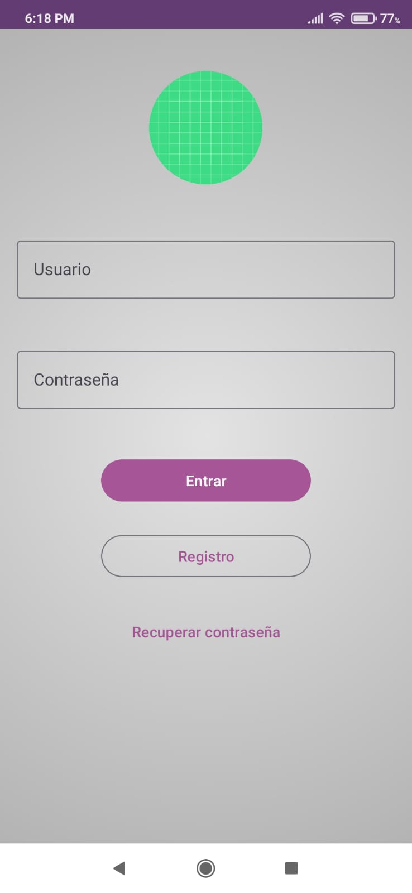
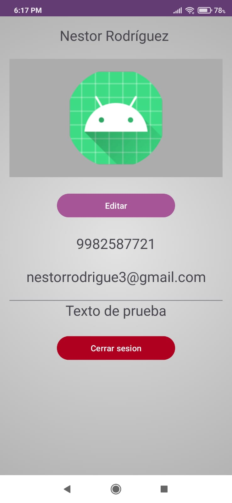
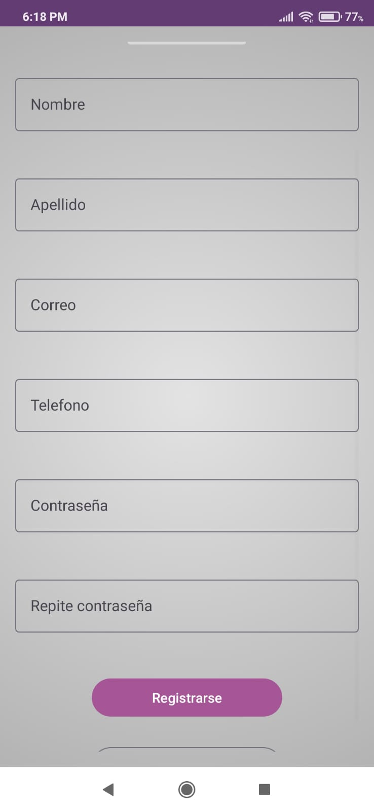
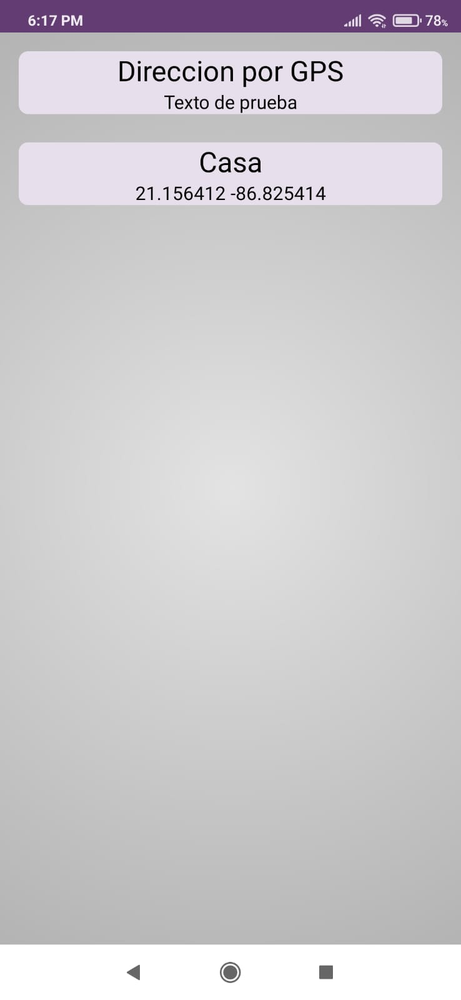
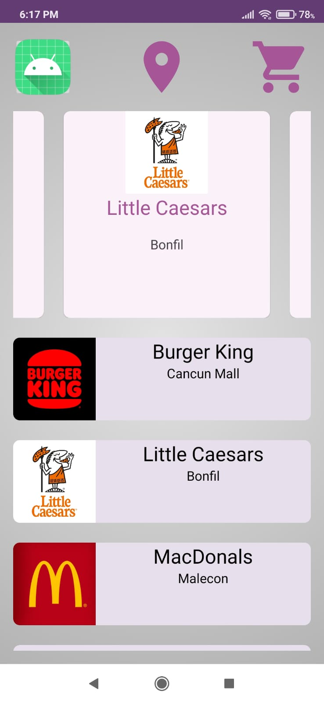

# DeliveryJT
Una propuesta de aplicacion de delivery

Por: Nestor Rodriguez Salgado

## Division del proyecto

Esta aplicación está constituida hasta el momento de:

1. 7 Activitys
2. 7 Clases
3. 12 Fragmens

Donde las pantallas principales es el Login, Dashboar, el perfil del usuario y la vista de las direcciones

## ¿Cual fue el alcance de este proyecto?

**Usuario**

* En la parte del usuario se manejó lo que es el login
* El registro del usuario (No se toma una imagen, para el usuario)
* Se colocó una vista de los datos del usuario
* Se colocó un boton para cerrar sesion
* Se permite editar la información del usuario como el correo y el teléfono (No el inicio de sesión)

**Restaurantes**

* Se implemento una vista, donde el usuario puede ver todos los restaurantes
* Se implemento dos recyclers views, uno en horizontal, donde se agrega restaurantes destacados y otro donde se ven todos los restaurantes
* Se implemento una vista del menu de los restaurantes

**Localizacion**

* Se implementó que se puedan ver un mapa
* Se implementó una vista donde se ven varias direcciones que el usuario tenga guardado

## ¿Que falto en el proyecto?

**Usuario**

* Poder recuperar la cuenta del usuario

**Restaurantes**

* Falta un lugar para que un restaurante pueda gestionar su menú
* Falta que un restaurante se pueda agregar 

**Localizacion**

* Faltó que en la vista de las direcciones, al precionar te lleve a la ubicacion guardada
* Faltó poder guardar nueva ubicaciones

**Compras**

* Falto que usuario pueda agregar cosas a su carrito
* Que pueda relizar la accion de comprar y sus consiguientes

## Capturas

| | ||
|--|--|--|
| |||
||||
